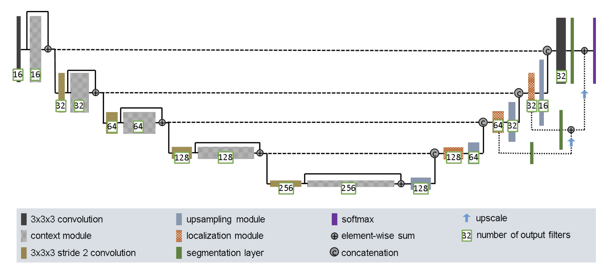
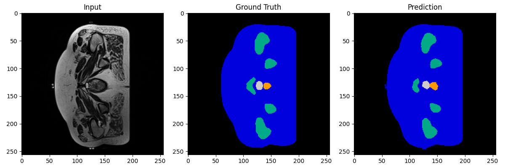
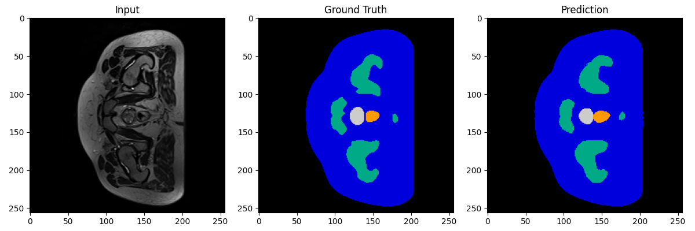
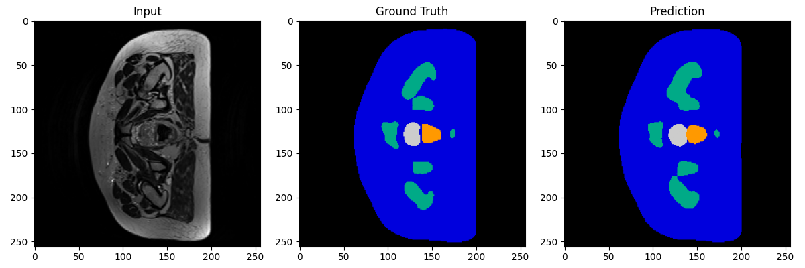
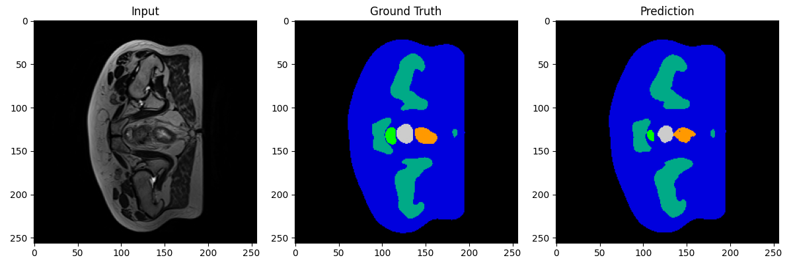
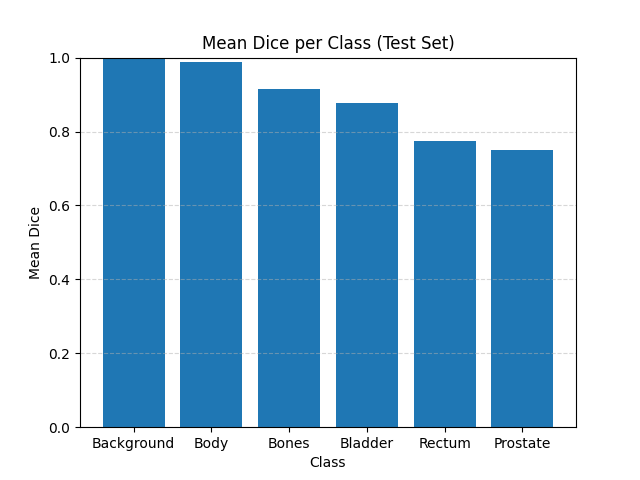
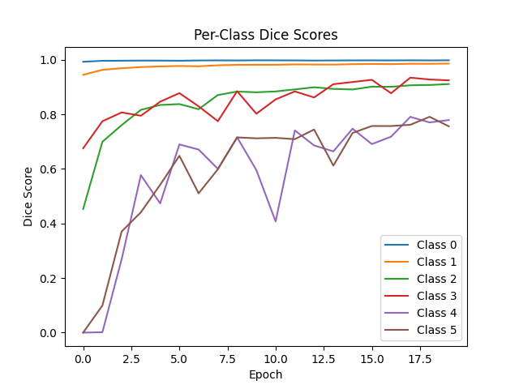
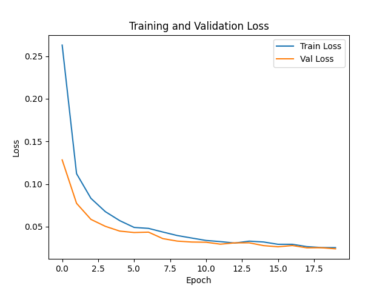

### Improved 3D UNet for Segmenting the HipMRI Prostate Dataset

Louisa Wu 48027296
COMP3710 2025 Semester 2

## Problem Description

This project implements an Improved 3D UNet to segment prostate structures from the HipMRI Prostate dataset. The target performance is a minimum Dice similarity score of 0.7 across all labels on the test set.

## Dataset Overview

The HipMRI Prostate data has been retrieved from the Calvary Mater Newcastle Hospital from a study conducted on MRI-alone radiation therapy (Dowling et al., 2015). The data was retrieved from 38 patients, resulting in a total of 211 3D MRI volumes.

I split the data into training, validation and test sets with a 70%, 15% and 15% split respectively to avoid patient overlap between splits. When creating these splits, a seed is used for reducibility to ensure that the splits are the same across runs.

The dataset has 6 semantic labels:

| Class | Semantic Label |
| ----- | -------------- |
| 0     | Background     |
| 1     | Body           |
| 2     | Bones          |
| 3     | Bladder        |
| 4     | Rectum         |
| 5     | Prostate       |

## Data Preprocessing

The dataset is lightly preprocessed before being loaded:

- **Intensity Normalisation:** Each image is standardised to have a mean of 0 and unit variance to improve training stability, making the model less sensitive to intensity variations.
- **Tensor Conversion:** When converting NumPy arrays to PyTorch tensors, a channel dimension is added to the image, which is required for convolution layers.
- **Optional Transformations:** Transformations such as augmentation, cropping and flipping can be applied to improve modularity. This is false by default as it was found that data augmentations did not significantly improve generalisation in validation Dice scores but increased the overhead computation.

## Model Architecture

The project is implemented using the 3D Improved UNet model taken from the paper: Brain Tumor Segmentation and Radiomics Survival Prediction: Contribution to the BRATS 2017 Challenge (Isensee et al., 2018).



The 3D Improved UNet model extends the classic UNet for 3D segmentations, allowing volumetric data to be processed using 3D convolutions.

### Architecture Components

**Encoder:**
The feature depth doubles at each step down the encoder path. It includes the following features:

- **3x3x3 Convolutions:** Extract local 3D features from input volumes
- **Strided Convolutions:** Use stride-2 convolutions instead of max pooling for downsampling, preserving more semantic information
- **Context Modules:** Includes residual convolution blocks (Conv + Dropout + Conv + residual sum) to expand receptive field and stabilise training

**Bottleneck**
Deepest layer in the network.

- **Context Modules:** Processes the most abstract volumetric features

**Decoder:**
The feature depth halves at each step up the decoder path. It has the following features:

- **Upsampling Modules:** Restores spatial resolution using transposed convolutions
- **Skip Connections:** Concatenates features from the corresponding encoder level
- **Localization Modules:** Refines features for accurate boundary prediction, using 3x3x3 convolutions followed by 1x1x1 layers

**Skip Connections**

- **Concatenation:** Features from encoder layers are passed directly to corresponding decoder layers, retaining finer spatial details lost during downsampling
- Instead of simple concatenations, some layers use **element-wise summation** to merge context and localisation features to maintain smoother gradients and reduce overfitting

**Segmentation Layer**

- **1x1x1 Convolution:** Generates segmentation predictions at multiple scales
- Segmentation maps are upsampled summed with the final output

**Output Layer**

- The final prediction is created after combining all segmentation layers
- Finish with **Softmax** to produce class probabilities

This model is an improved version of the **traditional UNet model**:

- Uses **strided convolutions** instead of pooling for downsampling to better preserve features
- Captures dependencies in context modules
- **More modular design**, making it easier to be extended with attention, residuals or deep supervision
- Includes **element-wise summation** in skip connections instead of just concatenations, helping gradients remain smooth and decrease overfitting
- Includes **dropouts** in context modules so it occurs during the encoding process and not just the bottleneck, reducing overfitting

## Evaluation Metrics

The model is trained for 20 epochs, and after every training epoch, performance is evaluated on a validation set, calculating the Dice similarity score for each label.

As a way to visualise segmentation results, I saved the cross-sectional slice of every 10th test sample.





The left panels show the axial cross sections of the raw greyscale MRI slices that the model receive as input for segmentation.The middle panels show the ground truth segmentation maps which serve as reference for evaluating model accuracy. Each class is colour-coded to differentiate the segmented regions. The right panels show the model's outputs after the inputs are processed through the 3D UNet. The colour-coded segmented regions should ideally match the ground truth.

The colour-coded regions of the outputs are mostly consistent with the ground truth's, indicating correct class mapping. There are no major misclassifications, which is a result of stable training and good generalisation.

The average Dice similarity score of each class waas plotted below:


This plot shows the mean Dice similarity score for each class on the test set, revealing the model's performance. The Dice coefficient measures the overlap between the predicted and ground truth segmentation masks, where a score of 1.0 means a perfect overlap and 0.0 means no overlap. All classes exceed the target Dice threshold of 0.7, indicating strong overall performance.

The Dice scores of Classes 4 (Rectum) and 5 (Prostate) are lower than the other classes as they represent smaller organs. However, Classes 0 (Background) and 1 (Body) have nearly perfect Dice scores, suggesting strong generalisation for large and well-defined structures.

I plotted the Dice scores during training. The following plot shows the Dice score of each label.


### General Observations

- Classes 0 (Background) and 1 (Body) are consistently high, staying near 1.0 throughout training. This suggests that the model can segment 'Background' and 'Body' easily due to the classes' large volume and low complexity.
- Classes 4 (Rectum) and 5 (Prostate) are more challenging for the model to segment, initially starting with low Dice scores. Throughout training, the Dice scores show more variability due to the classes' smaller volume and low contrast.
- Despite the initial low Dice values of Classes 4 and 5, they improve significantly over the training loop. This reflects effective learning and suggests the positive impacts of the Improved model's context modules and skip connections.
- Overall, the plot shows progressive learning across all classes with no overfitting, as Dice scores generally rise or stabilise.

I also plotted the observed training and validation loss below:


### General Observations

- Both the training and validation losses drop steadily over the 20 training epochs, indicating that the model is minimising error and learning meaningful features.
- The loss curves stay close together during training, suggesting that the model isn't overfitting to the training data and generalises well to unseen validation samples.
- The final loss values are both below 0.1, which is a good performance for multi-class segmentation and suggests good convergence and stable optimisation.
- There are no spikes, oscillations or plateaus in the plot, which is a result of a smooth and stable training process.
- This plot validates the effectiveness of the chosen optimiser, learning rate and epoch number.

## Dependencies and Reproducibility

For this project, the following dependencies were used with the specified versions:

- Python: 3.9
- PyTorch: 2.5.1
- NumPy: 2.0.1
- nibabel: 5.3.2
- matplotlib: 3.9.4

## Usage

To run the model training, run the following command in the project's root directory:

```python
python train.py
```

Running this command trains the Improved 3D UNet model and saves the weights of the trained model to a file named `improved_unet3d.pth`. This file can be reloaded using `model.load_state_dict(torch.load("improved_unet3d.pth"))`, which can be used to resume training or run inference on new data.

The prediction process requires the `"improved_unet3d.pth"` that was saved from the training process. Therefore, after running `train.py`, `predict.py` can be run to segment the data from the test set. Run the following command in the project's root directory:

```python
python predict.py
```

## Other Notes

The `modules.py` file includes both 2D and 3D UNet architectures, reflective of the recommended process of implementing the Improved 3D UNet. I began the project by building a 2D UNet to establish the foundational structure, then transitioned to a 3D UNet to handle volumetric data, and finally implemented the full Improved 3D UNet architecture to enhance segmentation performance.

## References

Dowling, J. A., Sun, J., Pichler, P., Rivest-Hénault, D., Ghose, S., Richardson, H., Wratten, C., Martin, J., Arm, J., Best, L., Chandra, S. S., Fripp, J., Menk, F. W., & Greer, P. B. (2015). Automatic Substitute Computed Tomography Generation and Contouring for Magnetic Resonance Imaging (MRI)-Alone External Beam Radiation Therapy From Standard MRI Sequences. International Journal of Radiation Oncology*Biology*Physics, 93(5), 1144–1153. https://doi.org/10.1016/j.ijrobp.2015.08.045

Isensee, F., Kickingereder, P., Wick, W., Bendszus, M., & Maier-Hein, Klaus H. (2018, February 28). Brain Tumor Segmentation and Radiomics Survival Prediction: Contribution to the BRATS 2017 Challenge. ArXiv.org; Cornell University. https://arxiv.org/abs/1802.10508v1
